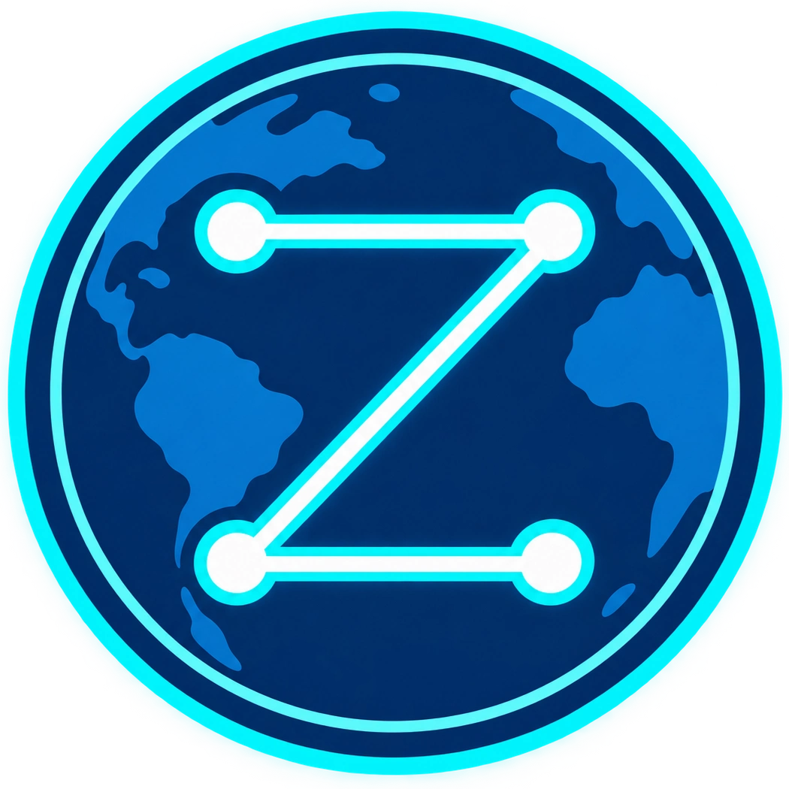

<p align="center">
  
</p>

<h1 align="center">ZION</h1>

<p align="center">
  <strong>Decentralized Human Network for AI Security Research</strong>
</p>

<p align="center">
  <em>We document what others dismiss.</em>
</p>

<p align="center">
  
  
  
  
  
  
  
  
</p>

<p align="center">
  <a href="SPEC.md"><strong>Protocol Spec</strong></a>
  ·
  <a href="docs/architecture/README.md"><strong>Architecture</strong></a>
  ·
  <a href="docs/deployment/public-internet-node.md"><strong>Deployment</strong></a>
  ·
  <a href="docs/guides/zion-web.md"><strong>ZION Web</strong></a>
  ·
  <a href="CONTRIBUTING.md"><strong>Contributing</strong></a>
</p>

---

ZION is an experimental decentralized human network for AI-security discussion, research curation, resource discovery, and resilient knowledge.

Current network: `zion-alpha-1`. This is alpha software, not mainnet: history may reset, validator membership and genesis may change, and canonical state may migrate. No coin or token exists in v0.1; ZION Points are deferred.

ZION Protocol v0.1 is a **Minimum Decentralized Product**: enough independent-node infrastructure to prove that people can discuss and curate AI-security knowledge without a mandatory central application database. The Go Native ZION Node is the v0.1 reference implementation. [`SPEC.md`](SPEC.md) is the implementation source of truth.

This repository implements the frozen ZION v0.1 MDP (Phases 1–13): canonical protocol and identity primitives, deterministic chain state, CometBFT finality, minimal governance, authenticated general libp2p discovery, a unified durable node runtime and local API, a small content-addressed object store with bounded direct peer retrieval, a signed off-chain community Board, governance-admitted canonical Research and Resource registries, the official replaceable Next.js local-node client, explicit state recovery, and local observability. ZION retains its native transaction, identity, membership, state, and hash semantics; CometBFT v1.0.1 supplies permissioned validator ordering and finality.

Phase 11 adds immutable, content-derived ResearchID and ResourceID records after canonical governance execution. Registry metadata and canonical references enter StateHash/AppHash, while object availability and local search indexes do not. Board links to registry IDs remain signed off-chain community statements. Graph inference, large-file features, replication/GC, automatic repository execution/update, and automated software migration remain deferred.

ZION Web is a presentation client, not a node or wallet. It talks directly from the browser to the local loopback `/v1` API, has no central production database/backend, and never requests member private keys. The current safe mutation workflow submits already-signed canonical transactions and Board events produced by local tooling.

## Download and run

| Want to…                   | Use                                                                                  |
| -------------------------- | ------------------------------------------------------------------------------------ |
| Run ZION on Windows        | Download the Windows amd64 ZIP, verify it, extract it, and run `run-zion-node.cmd`   |
| Run a Linux server         | Download the Linux amd64 tar.gz or use Docker Compose                                |
| Run a bootstrap node       | `docker compose --profile bootstrap up -d`                                           |
| Run a configured validator | Provision canonical validator files, then `docker compose --profile validator up -d` |
| Develop ZION               | Clone this repository and use the development commands below                         |

`git clone` is for developers, not ordinary binary users. Portable packages include the binaries, safe local presets, startup helper, license, and operator documentation. The bundled D1 presets remain local-only. The authoritative shared Internet-alpha genesis is [`configs/alpha-1/genesis.json`](configs/alpha-1/genesis.json), with GenesisID `72ef0c7816d64255fc7b1da266c6a5b5ca345dd89cba2423fc8cfc8b4d1a61c6`.

Docker users can start the optional local Web client with:

```text
docker compose --profile normal --profile web up -d
```

The node API and Web publish only to host loopback by default. The D2A public-host overlay publishes only ZION QUIC/UDP and runs no Web or validator. See [the Docker guide](docs/guides/docker.md), [provider-neutral public node deployment](docs/deployment/public-internet-node.md), [Windows installation](docs/guides/install-windows.md), and [Linux installation](docs/guides/install-linux.md).

## Development

Requires Go 1.27 or newer.

```text
go vet ./...
go test ./...
go test -race ./...
go build ./cmd/zion-node
go build ./cmd/zionctl
```

```text
zion-node --version
zionctl --version
```

See [`CONTRIBUTING.md`](CONTRIBUTING.md) for contribution expectations and [`docs/architecture/`](docs/architecture/) for protocol architecture notes.

## Alpha operation and recovery

Start with a shared role template ending in `.example.yaml` under `configs/alpha-1/` and verify the committed genesis locally with:

```text
go run ./cmd/zionctl genesis verify \
  --manifest configs/alpha-1/validators-public.json \
  --genesis configs/alpha-1/genesis.json \
  --genesis-id configs/alpha-1/genesis-id.txt
```

The API and `/metrics` bind to loopback by default. General libp2p (typically UDP 42000), the local API (TCP 42001), Web (TCP 3000), and CometBFT P2P (TCP 26656) are separate services and must not share ports. See [shared genesis](docs/protocol/shared-alpha-genesis.md).

```text
zion-node run --config zion.yaml
zionctl status
zionctl peers
zion-node state export --config zion.yaml --out state-backup.json
zion-node state inspect --in state-backup.json
```

Import is only for a stopped, fresh NORMAL node and never overwrites existing state. See [the alpha runbook](docs/operations/alpha-runbook.md), [operator runbook](docs/operations/operator-runbook.md), [API reference](docs/api/v1.md), and [architecture index](docs/architecture/README.md).

Build local Windows/Linux amd64 release packages with `scripts/build-release.ps1`. It emits traceable build metadata, dependency inventories, archives, and `SHA256SUMS`; no hosted service, code signature, or central database is required.

## ZION Web

Allow the exact local web origin in the node configuration (`http://127.0.0.1:3000`), then run:

```text
cd apps/web
npm ci
npm run dev
```

Open `http://127.0.0.1:3000`. The supported alpha workflow is local Web plus local `zion-node`; a hosted HTTPS page may be blocked from reaching local HTTP. See [`docs/guides/zion-web.md`](docs/guides/zion-web.md).
